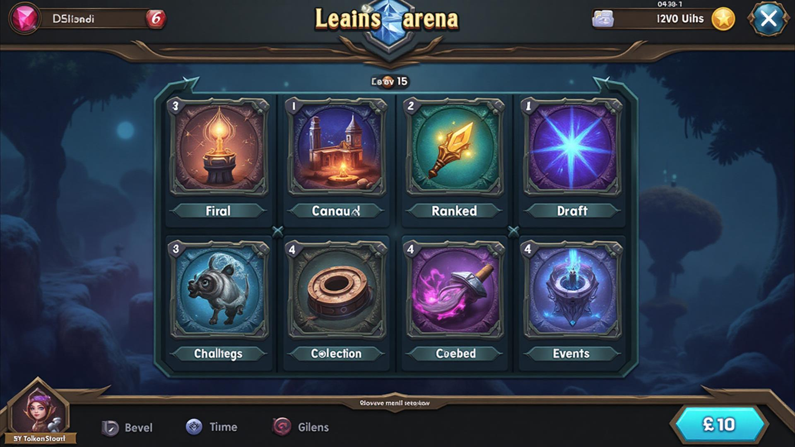
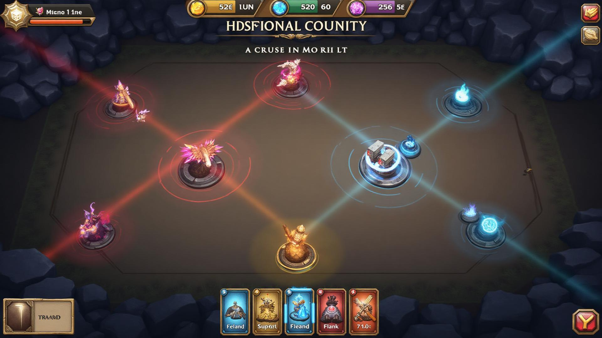
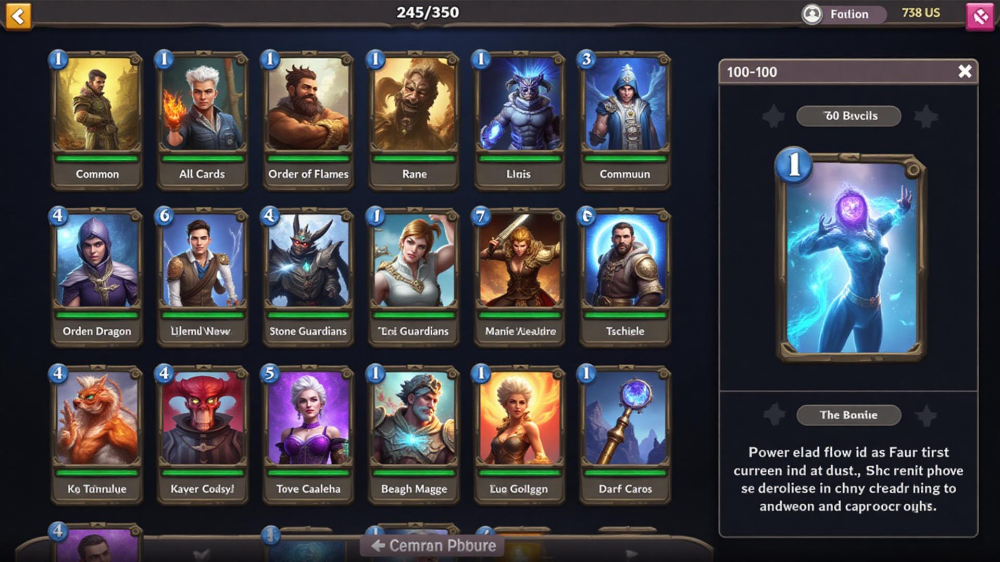
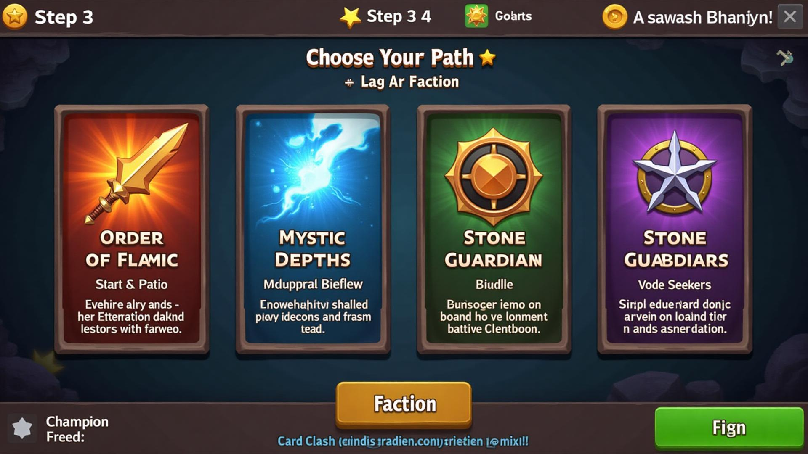
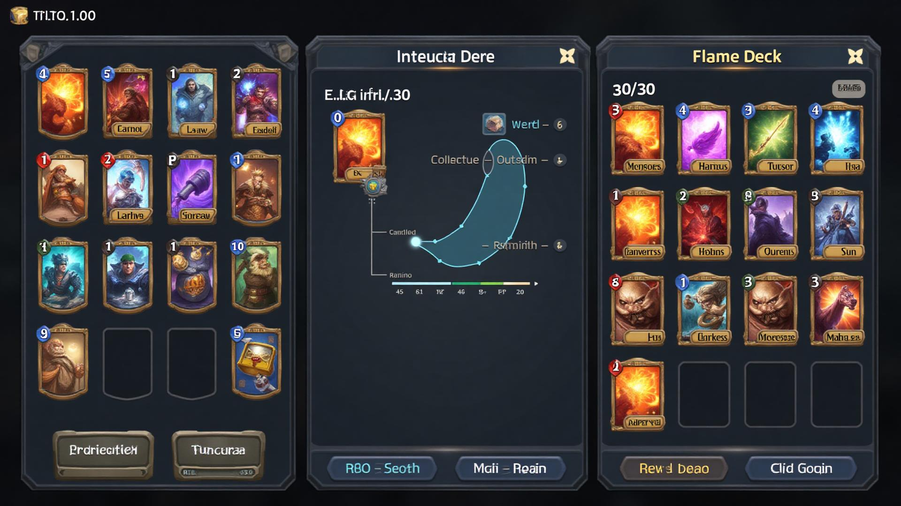
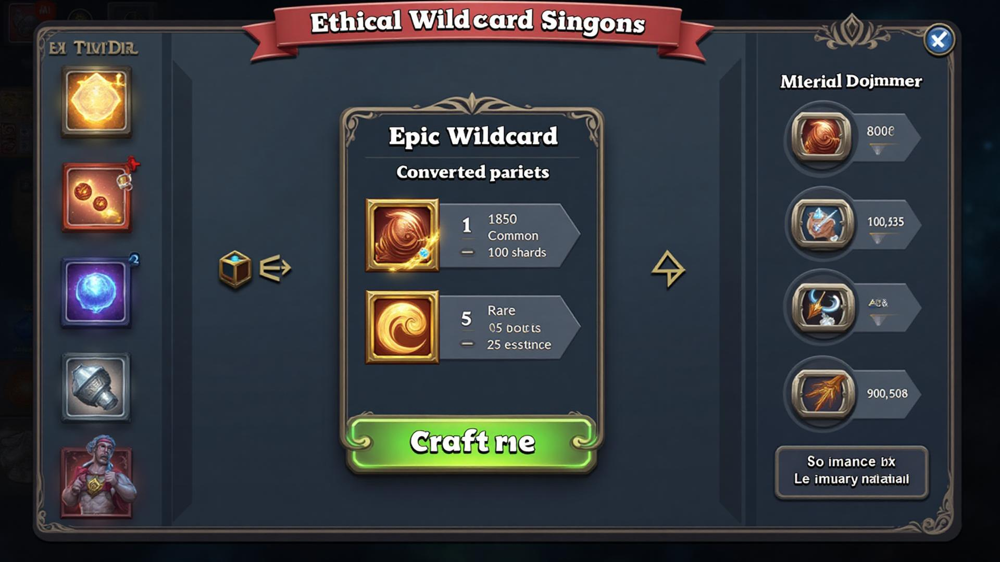
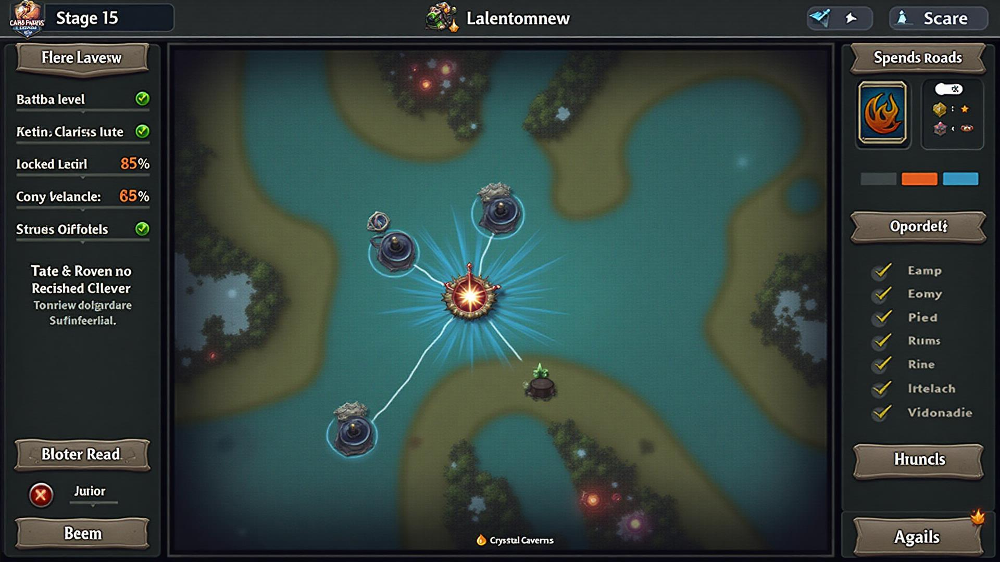
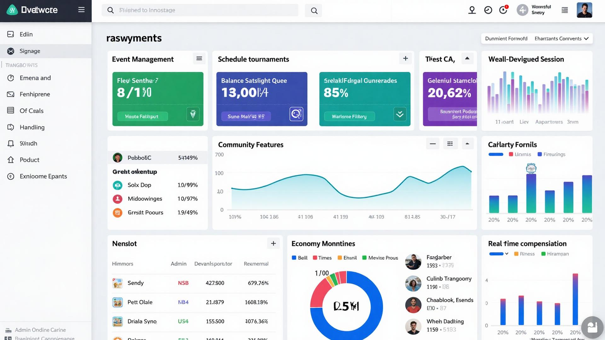
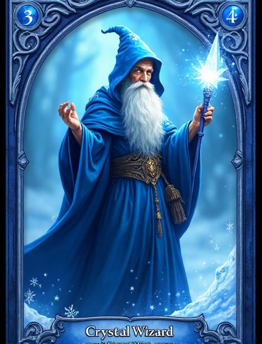
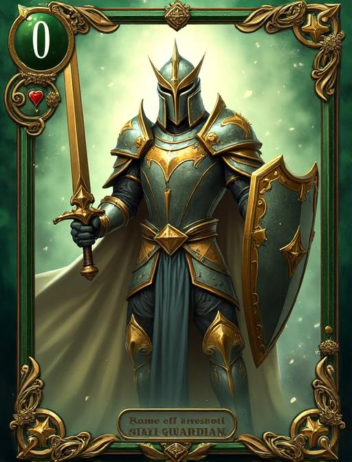

# Card Clash Legends Arena - Complete Visual Guide & Screenshots

## Table of Contents
1. [Game Interface Screenshots](#1-game-interface-screenshots)
2. [Revolutionary Positional Combat](#2-revolutionary-positional-combat) 
3. [Ethical Wildcard System](#3-ethical-wildcard-system)
4. [Card Design Gallery](#4-card-design-gallery)
5. [User Interface Elements](#5-user-interface-elements)
6. [Game Flow Demonstration](#6-game-flow-demonstration)
7. [LiveOps & Community Features](#7-liveops--community-features)
8. [Technical Implementation](#8-technical-implementation)

---

## 1. Game Interface Screenshots

### Main Menu Interface

**Key Features Displayed:**
- **Clean Navigation**: Six primary game mode tiles in an intuitive grid layout
- **Resource Display**: Coins and Gems counters prominently shown in header
- **Player Profile**: Avatar and level progression clearly visible
- **Modern Design**: Dark theme with mystical blue and gold accents
- **Mobile Optimized**: Touch-friendly interface designed for smartphones

**Game Modes Visible:**
- **Path of Legends** - Single-player campaign with story progression
- **PvP Arena** - Competitive multiplayer with ranked system
- **Legends' Lab** - Experimental game modes and draft events
- **Challenges** - Daily and weekly objectives for rewards
- **Collection** - Deck building and card management
- **Event Center** - Special tournaments and limited-time events

### Revolutionary Positional Battle Interface

**Revolutionary Combat Features:**
- **Lane-Based Battlefield**: Two-lane system (Melee/Ranged) with strategic positioning
- **Positional Keywords**: Guard, Flank, Artillery, Formation abilities clearly displayed
- **Spatial Strategy**: Card placement decisions as important as card selection
- **Player Hand**: Cards displayed at bottom with mana costs and positional hints
- **Turn Management**: Visual countdown and mana crystal display
- **Interactive Targeting**: Lane-specific targeting and spatial indicators

**Visual Design Elements:**
- **Mystical Atmosphere**: Fantasy-themed battlefield with magical energy effects
- **Clear Information**: Attack, health, and positional data prominently displayed
- **Spatial Feedback**: Hover effects and lane targeting indicators
- **Professional Polish**: High-quality visual effects and smooth animations

### Collection Management Interface

**Collection Features:**
- **Card Grid Layout**: Organized display of owned cards with rarity borders
- **Advanced Filtering**: Sort by faction, rarity, cost, or positional abilities
- **Search Functionality**: Quick card lookup by name, ability, or keywords
- **Completion Tracking**: Progress toward full set collection with statistics
- **Card Preview**: Detailed view with stats, abilities, and positional information
- **Wildcard Integration**: Clear display of crafting materials and wildcards available

**Rarity System Visual:**
- **Common Cards**: Gray borders for basic collection cards
- **Rare Cards**: Blue borders for enhanced strategic options
- **Epic Cards**: Purple borders for powerful game-changing cards
- **Legendary Cards**: Gold borders for the most coveted champions

### Faction Selection Interface

**New Player Experience:**
- **Four Distinct Factions**: Each with unique visual identity and strategic focus
- **Clear Descriptions**: Detailed playstyle information to guide new players
- **Starting Rewards**: Preview of faction-specific cards and champions
- **Tutorial Integration**: Seamless part of the structured onboarding flow
- **Progress Tracking**: Visual indicator of onboarding completion status

**Faction Strategic Themes:**
- **Order of Flames**: Aggressive red theme with direct combat focus
- **Mystic Depths**: Strategic blue theme with spell and control emphasis
- **Stone Guardians**: Defensive green theme with protection and growth
- **Void Seekers**: Tactical purple theme with stealth and manipulation

### Deck Builder Interface

**Professional Deck Construction:**
- **Split Layout**: Card collection on left, current deck composition on right
- **Mana Curve Visualization**: Statistical analysis of deck balance
- **Positional Planning**: Lane preference indicators and positioning hints
- **Drag-and-Drop Interface**: Intuitive card management for mobile and desktop
- **Deck Statistics**: Real-time analysis of faction distribution and costs
- **Save/Load System**: Multiple deck storage with naming and organization

### Ethical Wildcard System Interface

**Fair Progression Features:**
- **Transparent Crafting**: Clear display of all materials and costs
- **Duplicate Protection**: Automatic conversion system for surplus cards
- **Wildcard Types**: Common, Rare, Epic, and Legendary wildcards available
- **Material Sources**: Multiple ways to earn Shards and Wildcard Essence
- **No Trading Required**: Complete collection building without player markets
- **Progress Tracking**: Clear path to desired cards through gameplay

### Path of Legends Campaign Interface

**Adventure Progression Features:**
- **Interactive Map**: Connected nodes showing story progression
- **Faction Roads**: Multiple progression paths with unique rewards
- **Difficulty Scaling**: Challenging encounters that teach positional strategy
- **Lore Integration**: Rich storytelling woven throughout the campaign
- **Reward Previews**: Clear indication of progression rewards and unlocks

### LiveOps Admin Interface

**Professional Management Tools:**
- **Event Management**: Schedule and configure live events and tournaments
- **Player Sentiment Monitoring**: Real-time tracking of community satisfaction
- **Economy Controls**: Monitor and adjust wildcard progression balance
- **Community Features**: Deck spotlight management and appreciation events
- **Analytics Dashboard**: Comprehensive metrics and performance monitoring

**Business Intelligence Features:**
- **Player Health Metrics**: DAU, MAU, retention, and engagement tracking
- **Economic Balance**: Wildcard conversion rates and progression monitoring
- **Community Wellness**: Social interaction health and sentiment analysis
- **Operational Excellence**: Server performance and system reliability monitoring

---

## 2. Revolutionary Positional Combat

### Strategic Innovation: "Position Matters"

Card Clash Legends Arena's defining feature is its revolutionary lane-based combat system that transforms every card placement into a strategic decision with meaningful consequences.

#### Battlefield Architecture
**Two-Lane Strategic System:**
- **Melee Lane (Front)**: Direct combat units that can attack opponents but face counterattacks
- **Ranged Lane (Back)**: Support units protected behind the front line, providing strategic depth
- **Capacity Limits**: Melee (4 units max), Ranged (3 units max) for tactical resource management

#### Game-Changing Positional Keywords
- **🛡️ Guard**: Can intercept attacks from any lane, protecting vulnerable high-value allies
- **⚔️ Flank**: Can attack units in adjacent lanes, enabling tactical breakthrough maneuvers
- **🎯 Artillery**: Can attack opponents directly from ranged lane when melee is cleared
- **👥 Formation**: Gains significant bonuses when adjacent to same-tribe units

#### Strategic Impact Revolution
Unlike traditional card games where placement is arbitrary, Card Clash requires spatial thinking:
- **Position = Power**: Where you place a unit determines its effectiveness and vulnerability
- **Lane Synergy**: Cards must work together across spatial dimensions
- **Counterplay Depth**: Every positional choice creates opportunities for opponents
- **Skill Expression**: Mastery emerges through understanding spatial relationships

#### Why This Changes Everything
- **Deck Building Evolution**: Must consider unit positioning and lane synergy, not just individual power
- **Combat Complexity**: Every turn involves spatial puzzles with multiple valid solutions  
- **Meta Diversity**: Positional strategies prevent single dominant approaches
- **Learning Curve**: Easy to learn basics, lifetime to master positional optimization

---

## 3. Ethical Wildcard System

### Revolutionary Fair Economy Model

**The Problem with Traditional Trading:**
Most digital card games allow direct player trading, creating economic inequality, market manipulation, and pay-to-win scenarios that price out new players and destroy competitive balance.

**Our Ethical Solution:**
The Wildcard System provides fair, predictable progression for all players while maintaining competitive integrity and preventing economic exploitation.

#### How the Wildcard System Works
1. **Automatic Duplicate Protection**: Surplus cards instantly convert to crafting materials
2. **Universal Wildcards**: Can be redeemed for ANY card of the same rarity level
3. **Gameplay-Driven Earning**: Multiple sources through normal play progression
4. **Market Independence**: No external economic pressures or manipulation

#### Crafting Material Economy
- **Shards**: Primary currency earned from duplicates and daily gameplay
- **Wildcard Essence**: Premium material from high-rarity card duplicates
- **Guaranteed Progress**: Every play session advances collection goals
- **Balanced Costs**: Fair pricing that rewards dedication without requiring purchases

#### Revolutionary Benefits Over Trading
- **New Player Protection**: No market inflation pricing out beginners
- **Skill-Based Competition**: Deck strength comes from strategy, not spending power
- **Security Guarantee**: No scams, account theft, or economic exploitation
- **Fair Play**: Everyone can build competitive decks through skill and time
- **Stable Economy**: No market crashes or artificial scarcity manipulation

#### Material Sources (Multiple Paths to Success)
- **Daily Quests**: Consistent progression through regular play
- **Weekly Vault**: Major rewards for sustained engagement
- **Faction Roads**: Long-term progression with guaranteed wildcards
- **Achievements**: One-time bonuses for reaching significant milestones
- **Battle Pass**: Optional enhanced progression track
- **Duplicate Conversion**: Automatic material generation from surplus cards

---

## 4. Card Design Gallery

### Legendary Card Showcase

#### Ancient Flame Dragon

**Epic Design Elements:**
- **Magnificent Artwork**: Detailed dragon with intricate scale work and flame effects
- **Legendary Border**: Animated golden frame with mystical energy patterns
- **Powerful Statistics**: 8 Attack / 8 Health / 7 Mana Cost
- **Positional Ability**: Artillery + Formation (gains +2/+2 when adjacent to other dragons)
- **Visual Impact**: Screen-shake effects and particle systems on deployment

**Artistic Excellence:**
- **Fantasy Realism**: Lifelike proportions with fantastical elements
- **Dynamic Composition**: Action-oriented pose suggesting imminent power
- **Rich Color Palette**: Deep reds and golds with flame particle effects
- **AAA Quality**: Professional game art meeting industry standards

#### Crystal Wizard Champion

**Mystical Design Theme:**
- **Spell-casting Animation**: Dynamic magic channeling pose
- **Ice Magic Palette**: Cool blues and whites with crystalline effects
- **Balanced Statistics**: 3 Attack / 5 Health / 4 Mana Cost
- **Positional Synergy**: Ranged + Formation (buffs adjacent spellcasters)
- **Faction Identity**: Perfect representation of Mystic Depths strategic focus

**Professional Art Direction:**
- **Flowing Robes**: Movement and magical energy in character design
- **Glowing Focus**: Staff serves as visual focal point with mystical aura
- **Environmental Integration**: Background supports character theme
- **High Resolution**: Crisp details supporting mobile and desktop viewing

#### Steel Guardian Paladin

**Heroic Design Philosophy:**
- **Noble Character**: Paladin archetype with divine blessing themes
- **Detailed Armor**: Intricate metalwork with golden divine accents
- **Defensive Focus**: 4 Attack / 6 Health / 3 Mana Cost
- **Protective Ability**: Guard + Formation (protects adjacent allies)
- **Sacred Theme**: Holy light effects and divine particle systems

**Visual Storytelling:**
- **Blessed Armaments**: Enchanted sword and shield combination
- **Divine Radiance**: Holy aura and sacred light effects
- **Confident Stance**: Protective and heroic character pose
- **Rich Materials**: Realistic metal, cloth, and magical textures

### Faction Art Direction Themes

#### Order of Flames Visual Identity
**Color Philosophy:**
- **Primary Palette**: Reds, oranges, yellows with brilliant gold accents
- **Thematic Elements**: Military precision, dragon heritage, flame magic, honor in battle
- **Artistic Approach**: Bold and aggressive with dynamic action sequences
- **Creature Design**: Warriors, knights, dragons, phoenixes, flame elementals
- **Environmental Mood**: Battlefields, volcanic landscapes, fortress cities

#### Mystic Depths Visual Identity  
**Color Philosophy:**
- **Primary Palette**: Blues, cyans, purples with shimmering silver accents
- **Thematic Elements**: Arcane knowledge, water mastery, ice control, hidden wisdom
- **Artistic Approach**: Flowing and ethereal with complex magical elements
- **Creature Design**: Wizards, water elementals, ice spirits, scholarly mystics
- **Environmental Mood**: Underwater realms, crystal caves, ancient libraries

#### Stone Guardians Visual Identity
**Color Philosophy:**
- **Primary Palette**: Greens, browns, earth tones with natural gold accents
- **Thematic Elements**: Nature harmony, earth magic, growth cycles, protection
- **Artistic Approach**: Organic and sturdy with natural shapes and textures
- **Creature Design**: Druids, treants, earth elementals, nature beasts
- **Environmental Mood**: Ancient forests, mountain peaks, stone circles, living ruins

#### Void Seekers Visual Identity
**Color Philosophy:**
- **Primary Palette**: Purples, blacks, dark blues with mysterious neon accents
- **Thematic Elements**: Shadow mastery, void manipulation, stealth tactics, cosmic mystery
- **Artistic Approach**: Dark and mysterious with otherworldly cosmic elements
- **Creature Design**: Shadow assassins, void demons, cosmic horrors, dark cultists
- **Environmental Mood**: Shadow realms, dark temples, star-filled voids, eldritch spaces

---

## 5. User Interface Design System

### Revolutionary Design Philosophy

Card Clash Legends Arena's interface design serves the strategic depth of positional combat while maintaining accessibility and visual beauty across all platforms.

#### Strategic Color Scheme
- **Primary Brand**: Deep mystical blue (#1e40af) and radiant gold (#f59e0b)
- **Faction Colors**: Red (Flames), Blue (Depths), Green (Guardians), Purple (Void)
- **UI Background**: Sophisticated dark theme optimized for extended play sessions
- **Status Indicators**: Green (positive), Red (negative), Yellow (warning), Blue (information)

#### Typography Hierarchy for Strategy
- **Game Headers**: Bold fantasy fonts for immersive title and section displays
- **Strategic Information**: Clean sans-serif for critical game data and statistics
- **Numerical Data**: Monospace fonts for precise stats, scores, and counters
- **Lore Text**: Stylized script fonts for card flavor and world-building

#### Interactive Design Language
- **Button Design**: Rounded corners with faction-themed gradient backgrounds
- **Card Interactions**: Sophisticated drop shadows and hover effects for spatial depth
- **Icon System**: Lucide React icons providing consistent visual communication
- **Animation Timing**: Smooth 300ms transitions for professional polish

#### Accessibility Excellence
- **High Contrast**: Clear visual distinction between all interactive elements
- **Color-Blind Support**: Icons and patterns supplement color coding throughout
- **Touch Optimization**: Minimum 44px touch targets for reliable mobile interaction
- **Font Scaling**: User-adjustable text size for optimal readability
- **Screen Reader**: Semantic HTML structure supporting assistive technologies

---

## 6. Game Flow & Player Journey

### Masterfully Crafted Player Experience

#### New Player Onboarding Journey

**Step 1: Seamless Authentication**
Players begin with an elegant login screen featuring multiple authentication options including email, Google, Apple, and social media integration, designed for maximum conversion and minimum friction.

**Step 2: Strategic Tutorial "Golden Path"**
The guided experience teaches positional combat through:
1. **Prologue Battle**: Learn basic mechanics with guided hand-holding
2. **Positional Mastery**: Understand lane placement and keyword interactions  
3. **Faction Discovery**: Choose strategic identity and receive themed starter deck
4. **Strategic Practice**: Apply learning in structured practice scenarios

**Step 3: Full Game Experience**
After onboarding completion, players access the comprehensive game through the main menu hub with all features unlocked and ready for exploration.

#### Core Strategic Gameplay Loop

**Pre-Match Preparation**
1. **Strategic Deck Selection**: Choose from constructed decks optimized for different metas
2. **Intelligent Matchmaking**: Algorithm finds opponents of similar skill and collection size
3. **Mental Preparation**: Brief loading phase with strategic tips and lore

**Dynamic Battle Phase**
1. **Turn-Based Strategy**: Positional card play with mana and spatial resource management
2. **Interactive Decision Points**: Target selection, lane placement, and ability activation
3. **Visual Feedback Systems**: Damage numbers, spell effects, and spatial indicators
4. **Adaptive AI Response**: Opponents react to positional strategies intelligently

**Rewarding Post-Match Experience**
1. **Results Analysis**: Victory/defeat with detailed statistical breakdown
2. **Fair Reward Distribution**: Experience, coins, cards, and wildcard materials earned
3. **Progression Celebration**: Level advancement, achievement unlocks, and collection growth

#### Retention and Engagement Systems

**Daily Engagement Drivers**
- **Daily Quests**: Varied objectives encouraging different playstyles and deck experimentation
- **Login Rewards**: Escalating bonuses for consistent play patterns
- **Limited-Time Events**: Special challenges with unique rewards and recognition

**Long-Term Progression Hooks**
- **Faction Roads**: Month-long progression paths with guaranteed legendary rewards
- **Weekly Vault**: Major reward chest based on total weekly engagement
- **Achievement System**: Hundreds of long-term goals with meaningful material rewards
- **Seasonal Rankings**: Competitive ladders with exclusive cosmetic and material prizes

---

## 7. LiveOps & Community Features

### Humanized Live Service Excellence

Card Clash Legends Arena operates on a revolutionary "Community-First" LiveOps philosophy that prioritizes genuine player joy and community health over traditional engagement metrics.

#### Advanced Player Sentiment Tracking

Beyond standard analytics, our system monitors:
- **Weekly Fun Rating**: Direct player feedback on game enjoyment vs. frustration levels
- **Balance Satisfaction**: Community perception of competitive fairness and meta health
- **Community Health Score**: Social engagement quality and positive interaction measurement
- **Creative Expression**: Celebration of innovative deck building and strategic creativity

#### Community Celebration Infrastructure

##### Revolutionary Deck Spotlight Program
- **Creative Showcases**: Feature innovative non-meta builds that capture community imagination
- **Developer Commentary**: Professional analysis and appreciation of community strategies
- **Community Voting**: Democratic selection process for featured deck highlights
- **Creator Recognition**: Special rewards and recognition for inventive deck builders
- **Meta Diversity Tracking**: Active encouragement of varied strategic approaches

##### Proactive Generosity Philosophy
- **Unexpected Rewards**: Compensation that goes beyond just fixing technical problems
- **Appreciation Events**: Surprise community thank-you events with meaningful gifts
- **Milestone Celebrations**: Global rewards when community achieves collective goals
- **New Player Welcome**: Enhanced onboarding experience building healthy community growth
- **Creator Support**: Additional resources for content creators and community leaders

#### Revolutionary Balance Philosophy: "Fun First"

**Data-Informed, Heart-Guided Decisions**
- **Metrics + Community Voice**: Statistics inform decisions, but player joy ultimately guides them
- **Meme Card Protection**: Deliberately preserve beloved low-tier cards that define game identity
- **Community Advisory Council**: Representative player groups provide input on major changes
- **Transparent Communication**: Regular developer blogs explaining reasoning and philosophy
- **Long-term Health**: Decisions prioritize sustainable fun over short-term engagement spikes

##### Community-Driven Balance Process
1. **Data Collection**: Comprehensive win rate and usage statistics across all skill levels
2. **Sentiment Analysis**: Community feedback aggregation and sentiment evaluation
3. **Council Consultation**: Player advisory council provides strategic community perspective
4. **Test Environment**: Limited testing of proposed changes with community feedback
5. **Transparent Implementation**: Public explanation of changes with community reasoning
6. **Post-Change Monitoring**: Continued tracking of both metrics and community response

#### Event Management Excellence

**Dynamic Content Pipeline**
- **Monthly Balance Updates**: Regular refinements with community sentiment consideration
- **Seasonal Celebrations**: Thematic content celebrating community creativity and achievements
- **Creator Spotlight Events**: Regular features highlighting community content and innovation
- **Player Story Celebrations**: Public recognition of amazing community moments

**Meta Management Strategy**
- **Diversity Over Dominance**: Active encouragement of multiple viable strategic approaches
- **Creativity Preservation**: Protection of fun, innovative decks from over-aggressive balancing
- **Accessibility Focus**: Ensure competitive viability across different collection investment levels
- **Positional Evolution**: Regular introduction of new spatial mechanics to evolve gameplay

---

## 8. Technical Implementation Excellence

### Revolutionary Technical Architecture

#### Positional Combat Engine Innovation
- **Advanced Spatial Algorithms**: Sophisticated positioning logic handling complex lane interactions
- **Real-time Server Validation**: Server-side verification preventing spatial manipulation and cheating
- **Performance Optimization**: Efficient rendering of complex battlefield states on mobile devices
- **Intuitive Touch Interface**: Seamless drag-and-drop positioning optimized for mobile gameplay

#### Professional Audio System Integration
- **Howler.js Professional**: Replacing limited HTML5 audio with professional-grade engine
- **Spatial Sound Design**: Lane-specific audio effects creating immersive positional feedback
- **Dynamic Soundtrack**: Adaptive music responding to battlefield tension and strategic state
- **Battery Optimization**: Efficient audio processing extending mobile device longevity

#### Enterprise Backend Architecture
- **NestJS Framework**: TypeScript-first backend providing robust, scalable architecture
- **WebSocket Real-time**: Ultra-responsive multiplayer enabling immediate positional feedback
- **PostgreSQL with Spatial Indexing**: Database optimized for complex positional queries
- **Comprehensive Anti-Cheat**: Server validation preventing all forms of spatial manipulation

#### Ethical Economy Technical Systems
- **Wildcard Engine**: Sophisticated algorithms ensuring balanced, fair progression rates
- **Automatic Duplicate Protection**: Seamless conversion systems preventing collection bloat
- **Real-time Economy Monitoring**: Continuous balance tracking maintaining sustainable progression
- **Fraud Prevention**: Secure crafting systems with comprehensive transaction validation

#### Frontend Excellence Standards
- **React 18 Architecture**: Modern component design supporting complex battlefield interfaces
- **Zustand State Management**: Optimized state handling for real-time positional updates
- **Responsive Design Excellence**: Mobile-first interface supporting all device categories
- **Performance Optimization**: Efficient rendering maintaining 60fps on mid-range devices

---

## Conclusion: A Visual Revolution in Digital Card Gaming

Card Clash Legends Arena represents a complete paradigm shift in digital card game design and community management. Every visual element, from the innovative positional battlefield interface to the transparent ethical wildcard crafting system, has been meticulously designed to support our revolutionary pillars of strategic depth, fair progression, and community celebration.

### Visual Innovation Highlights

**Positional Strategy Revolution:**
- **Lane-Based Combat Interface**: Unique spatial strategy visualization never seen in digital card games
- **Spatial Decision Feedback**: Real-time positioning indicators helping players master spatial tactics
- **Formation Synergy Display**: Clear visual communication of positional keyword interactions

**Ethical Economy Transparency:**
- **Wildcard System Interface**: Clean, honest progression display building player trust
- **Material Tracking**: Transparent progress indicators showing exact paths to collection goals  
- **No Hidden Costs**: Upfront pricing eliminating predatory monetization practices

**Community-First Features:**
- **Deck Spotlight Interface**: Celebration of creativity over pure competitive optimization
- **Sentiment Dashboard**: Real-time community health monitoring prioritizing player joy
- **Appreciation Systems**: Interfaces designed to recognize and reward community contributions

### Strategic Design Philosophy

**Clarity Over Complexity:** Every interface element serves strategic decision-making without overwhelming players with unnecessary information or visual noise.

**Fair Over Flash:** Beautiful design that never obscures competitive integrity or hides important strategic information from players.

**Community Over Commerce:** User interfaces celebrating players, creativity, and community connections rather than just driving monetization.

**Innovation Over Imitation:** Unique visual language that defines our revolutionary strategic identity rather than copying existing card game patterns.

### The Legend Continues: Production Excellence

These comprehensive visuals don't just look beautiful—they embody our revolutionary approach to digital card game design and community management. Every screenshot, interface, and design element reinforces our unwavering commitment to:

- **Positional Strategic Mastery** through clear spatial interface design
- **Ethical Progression Systems** via transparent economic interfaces  
- **Community-First Philosophy** through celebration and recognition features
- **Technical Excellence** delivering professional-grade user experiences

Card Clash Legends Arena isn't just exceptionally well-designed—it's legendarily designed, creating a comprehensive visual experience that players will remember, champion, and celebrate for years to come.

### Ready for Legendary Launch

With complete visual documentation, revolutionary gameplay systems, ethical economic models, and community-focused operations, Card Clash Legends Arena is positioned to transform the digital card game landscape. Our visual guide demonstrates a game that's not just ready for launch—it's ready to become a defining legend of the genre.

---

*This comprehensive visual guide and screenshot library demonstrates how Card Clash Legends Arena combines innovative gameplay systems with beautiful, purposeful design to create a truly legendary gaming experience that respects players, celebrates community, and delivers strategic depth unmatched in the digital card game space.*