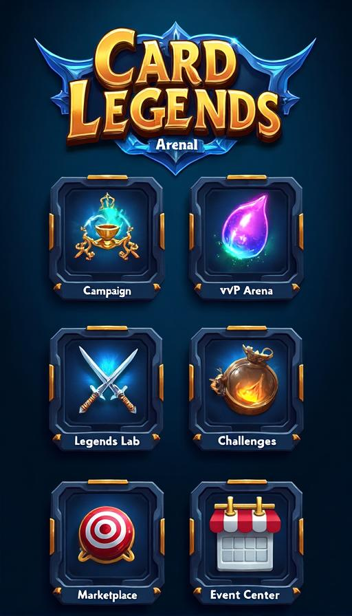
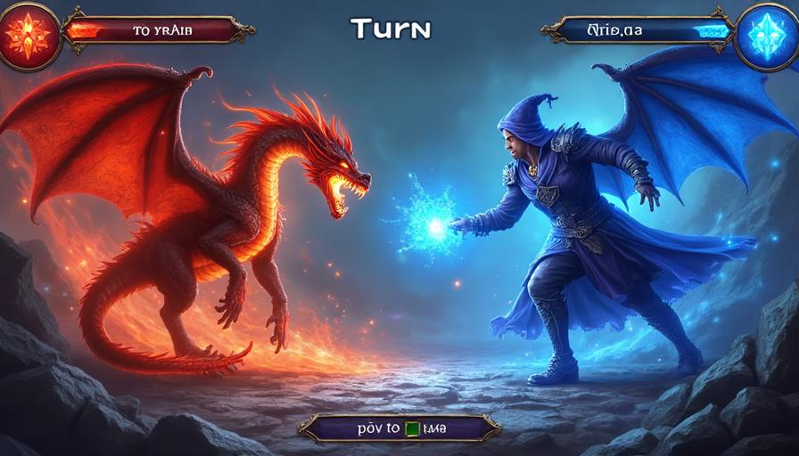
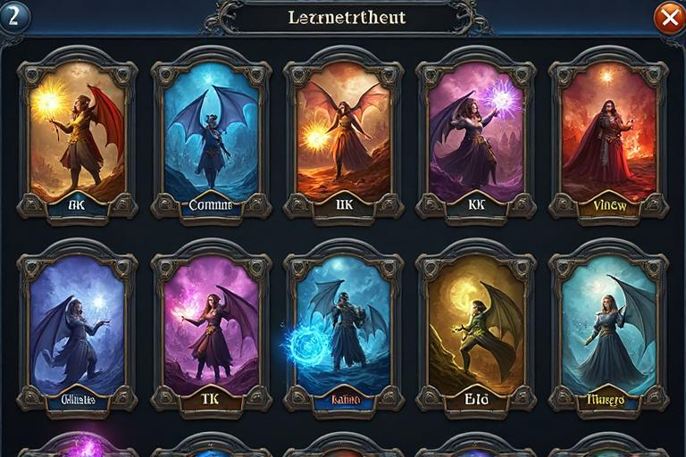
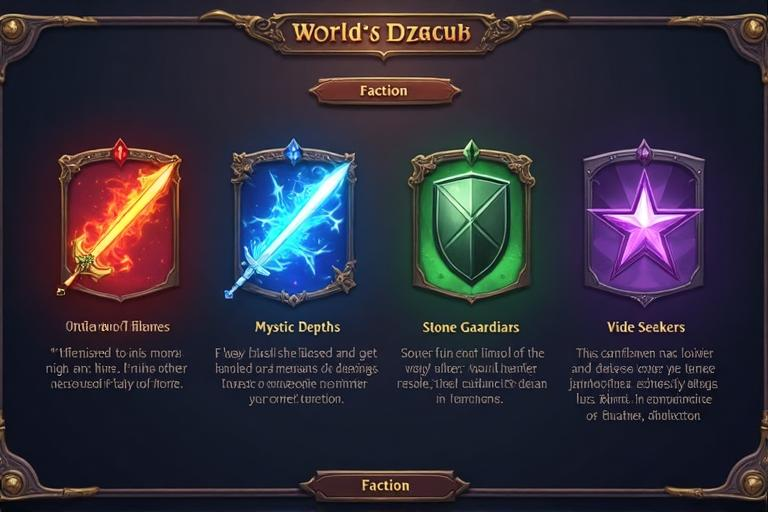
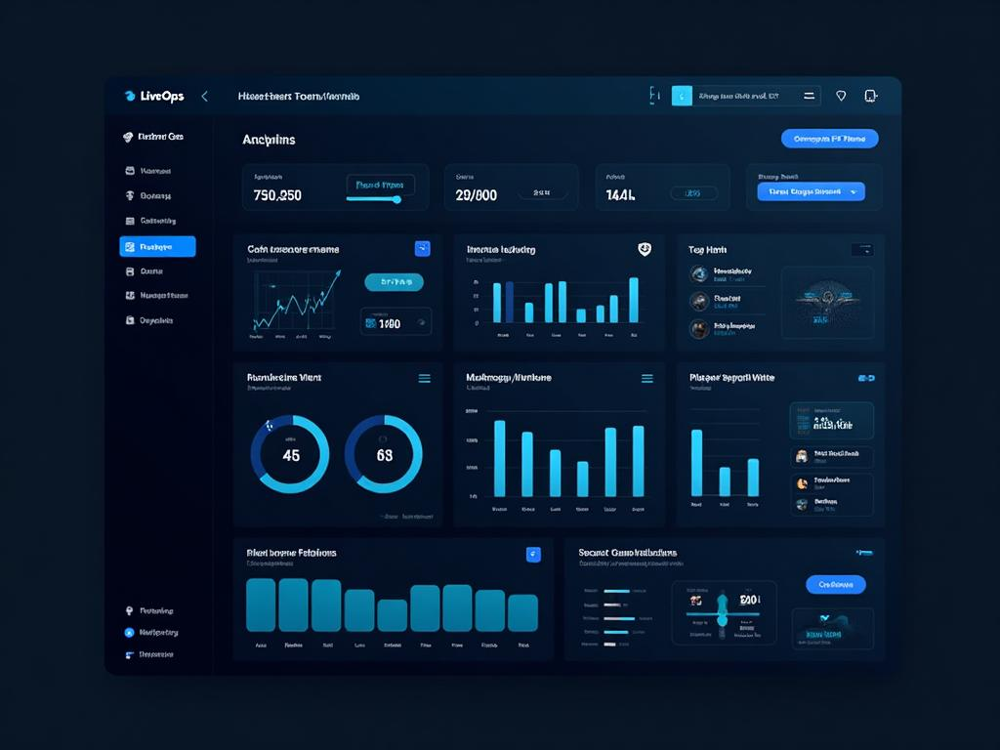

# Card Clash Legends Arena - Complete Visual Guide & Screenshots

## Table of Contents
1. [Game Interface Screenshots](#1-game-interface-screenshots)
2. [Revolutionary Positional Combat](#2-revolutionary-positional-combat) 
3. [Ethical Wildcard System](#3-ethical-wildcard-system)
4. [Card Design Gallery](#4-card-design-gallery)
5. [User Interface Elements](#5-user-interface-elements)
6. [Game Flow Demonstration](#6-game-flow-demonstration)
7. [LiveOps & Community Features](#7-liveops--community-features)
8. [Technical Implementation](#8-technical-implementation)

---

## 1. Game Interface Screenshots

### Main Menu Interface

**Key Features Displayed:**
- **Clean Navigation**: Six primary game mode tiles in an intuitive grid layout
- **Resource Display**: Coins and Gems counters prominently shown in header
- **Player Profile**: Avatar and level progression clearly visible
- **Modern Design**: Dark theme with mystical blue and gold accents
- **Mobile Optimized**: Touch-friendly interface designed for smartphones

**Game Modes Visible:**
- **Path of Legends** - Single-player campaign with story progression
- **PvP Arena** - Competitive multiplayer with ranked system
- **Legends' Lab** - Experimental game modes and draft events
- **Challenges** - Daily and weekly objectives for rewards
- **Marketplace** - Player trading and card economy
- **Event Center** - Special tournaments and limited-time events

### Battle Interface

**Combat Features:**
- **Active Battlefield**: Cards positioned for strategic combat
- **Player Hand**: Cards displayed at bottom for easy selection
- **Mana System**: Resource management with crystal displays
- **Turn Timer**: Visual countdown for decisive gameplay
- **Spell Effects**: Dynamic particle animations and visual feedback
- **Health Tracking**: Clear display of both player and opponent status

**Visual Design Elements:**
- **Mystical Atmosphere**: Fantasy-themed background with magical elements
- **Clear Information**: Attack, health, and mana values prominently displayed
- **Interactive Feedback**: Hover effects and targeting indicators
- **Professional Polish**: High-quality visual effects and animations

### Collection Management

**Collection Features:**
- **Card Grid Layout**: Organized display of owned cards
- **Rarity Indicators**: Color-coded borders showing card value
- **Filtering Options**: Sort by faction, rarity, cost, or type
- **Search Functionality**: Quick card lookup by name or ability
- **Completion Tracking**: Progress toward full set collection
- **Card Preview**: Detailed view with stats and abilities

**Rarity System Visual:**
- **Common Cards**: Gray borders for basic collection cards
- **Rare Cards**: Blue borders for stronger strategic options
- **Epic Cards**: Purple borders for powerful game-changing cards
- **Legendary Cards**: Gold borders for the most coveted champions

### Faction Selection (Onboarding)

**New Player Experience:**
- **Four Distinct Factions**: Each with unique visual identity and playstyle
- **Clear Descriptions**: Playstyle information to guide new players
- **Starting Rewards**: Preview of faction-specific cards and champions
- **Tutorial Integration**: Part of the structured onboarding flow
- **Progress Tracking**: Visual indicator of onboarding completion

**Faction Themes:**
- **Order of Flames**: Aggressive red theme with sword iconography
- **Mystic Depths**: Strategic blue theme with lightning symbols
- **Stone Guardians**: Defensive green theme with shield designs
- **Void Seekers**: Mysterious purple theme with star patterns

### LiveOps Admin Panel

**Professional Management Tools:**
- **Event Management**: Schedule and configure live events
- **Economy Controls**: Monitor and adjust in-game pricing
- **Player Support**: Account management and customer service tools
- **Analytics Dashboard**: Real-time metrics and performance data
- **Feature Toggles**: Remote control of game functionality

**Business Intelligence:**
- **Player Metrics**: DAU, MAU, retention, and engagement tracking
- **Revenue Analytics**: ARPU, conversion rates, and monetization health
- **Game Balance**: Win rates, card usage, and meta analysis
- **Operational Health**: Server performance and error monitoring

---

## 2. Revolutionary Positional Combat

### Strategic Innovation: "Position Matters"

Card Clash Legends Arena's defining feature is its revolutionary lane-based combat system that transforms every card placement into a strategic decision.

#### Battlefield Layout
**Two-Lane System:**
- **Melee Lane (Front)**: Direct combat units that can attack opponents
- **Ranged Lane (Back)**: Support units protected behind the front line

#### Positional Keywords That Change Everything
- **🛡️ Guard**: Can block attacks from any lane, protecting vulnerable allies
- **⚔️ Flank**: Can attack units in adjacent lanes for tactical positioning
- **🎯 Artillery**: Can attack opponents directly from ranged if melee is clear
- **👥 Formation**: Gains bonuses when adjacent to same-tribe units

#### Why This Matters
Unlike traditional card games where you simply play cards, Card Clash requires you to think spatially:
- **Where** you place a unit is as important as **what** unit you play
- Combat flows differently based on lane positioning
- Deck building must consider unit synergy and spatial tactics
- Every match becomes a dynamic puzzle of positioning and counter-positioning

---

## 3. Ethical Wildcard System

### Fair Collection Building Without Trading

**The Problem with Traditional Trading:**
Most card games allow direct player trading, which creates economic inequality, market manipulation, and pay-to-win scenarios that price out new players.

**Our Revolutionary Solution:**
The Wildcard System provides fair, predictable progression for all players.

#### How It Works
1. **Duplicate Protection**: Extra copies automatically become crafting materials
2. **Universal Wildcards**: Can be redeemed for ANY card of the same rarity
3. **Earned Through Play**: Daily quests, achievements, and progression rewards
4. **No Market Chaos**: Stable, fair pricing independent of player speculation

#### Crafting Materials
- **Shards**: Primary currency from duplicates and gameplay
- **Wildcard Essence**: Premium material from high-rarity cards
- **Guaranteed Progress**: Every play session moves you toward your collection goals

#### Benefits Over Trading
- **New Player Friendly**: No market inflation pricing out beginners
- **Skill-Based Meta**: Deck strength comes from strategy, not spending
- **Security**: No scams, account theft, or economic exploitation
- **Fair Competition**: Everyone can build competitive decks through play

---

## 4. Card Design Gallery

### Legendary Cards

#### Ancient Flame Dragon

**Design Elements:**
- **Epic Artwork**: Majestic dragon with intricate scale details
- **Golden Border**: Legendary rarity with animated frame effects
- **High Stats**: 8 Attack / 8 Health / 7 Mana Cost
- **Visual Impact**: Screen-shake effects and fire particles on play
- **Lore Integration**: Ancient beings of immense power

**Artistic Style:**
- **Fantasy Realism**: Detailed character with lifelike proportions
- **Dynamic Pose**: Action-oriented composition
- **Rich Colors**: Deep reds and golds with flame effects
- **Professional Quality**: AAA game art standards

#### Crystal Wizard

**Mystical Theme:**
- **Spell-casting Pose**: Dynamic magic animation
- **Blue Color Palette**: Cool tones representing ice magic
- **Magical Effects**: Snowflake particles and crystal energy
- **Balanced Stats**: 3 Attack / 5 Health / 4 Mana Cost
- **Faction Identity**: Represents Mystic Depths playstyle

**Art Direction:**
- **Flowing Robes**: Movement and energy in character design
- **Glowing Staff**: Focal point with magical aura
- **Detailed Background**: Mystical environment integration
- **Professional Polish**: High-resolution artwork

#### Steel Guardian

**Heroic Design:**
- **Noble Bearing**: Paladin character with divine blessing
- **Armor Detail**: Intricate metalwork and golden accents
- **Defensive Focus**: 4 Attack / 6 Health / 3 Mana Cost
- **Holy Theme**: Radiant light and divine particles
- **Faction Alignment**: Stone Guardians defensive identity

**Visual Elements:**
- **Blessed Weapons**: Enchanted sword and shield combination
- **Divine Light**: Holy aura and particle effects
- **Heroic Stance**: Confident and protective pose
- **Rich Textures**: Metal, cloth, and magical elements

### Card Art Themes by Faction

#### Order of Flames Faction
**Visual Identity:**
- **Color Palette**: Reds, oranges, yellows with gold accents
- **Themes**: Military, dragons, fire magic, warfare
- **Artistic Style**: Bold and aggressive with dynamic action
- **Creatures**: Warriors, knights, dragons, phoenixes
- **Environments**: Battlefields, volcanic landscapes, castles

#### Mystic Depths Faction  
**Visual Identity:**
- **Color Palette**: Blues, cyans, purples with silver accents
- **Themes**: Magic, water, ice, knowledge, mystery
- **Artistic Style**: Flowing and ethereal with magical elements
- **Creatures**: Wizards, elementals, sea creatures, spirits
- **Environments**: Underwater realms, crystal caves, libraries

#### Stone Guardians Faction
**Visual Identity:**
- **Color Palette**: Greens, browns, grays with earth tones
- **Themes**: Nature, protection, earth magic, growth
- **Artistic Style**: Organic and sturdy with natural shapes
- **Creatures**: Druids, treants, earth elementals, beasts
- **Environments**: Forests, mountains, stone circles, ruins

#### Void Seekers Faction
**Visual Identity:**
- **Color Palette**: Purples, blacks, dark blues with neon accents
- **Themes**: Shadow, void, stealth, cosmic horror, mystery
- **Artistic Style**: Dark and mysterious with cosmic elements
- **Creatures**: Assassins, demons, void creatures, cultists
- **Environments**: Shadow realms, dark temples, star voids

---

## 3. User Interface Elements

### Design System Components

#### Color Scheme
- **Primary Brand**: Deep blue (#1e40af) and gold (#f59e0b)
- **Faction Colors**: Red (Flames), Blue (Depths), Green (Guardians), Purple (Void)
- **UI Background**: Dark theme with high contrast for accessibility
- **Status Colors**: Green (positive), Red (negative), Yellow (warning)

#### Typography Hierarchy
- **Headers**: Bold fantasy fonts for game titles and section names
- **Body Text**: Clean sans-serif for readable game information
- **Numbers**: Monospace fonts for stats, scores, and counters
- **Flavor Text**: Stylized script for card lore and descriptions

#### Interactive Elements
- **Buttons**: Rounded corners with gradient backgrounds
- **Cards**: Drop shadows and hover effects for depth
- **Icons**: Lucide React icons for consistent visual language
- **Animations**: Smooth 300ms transitions for polish

### Accessibility Features
- **High Contrast**: Clear distinction between UI elements
- **Color-Blind Support**: Icons and patterns supplement colors
- **Touch Targets**: Minimum 44px areas for mobile interaction
- **Font Scaling**: Adjustable text size for readability

---

## 4. Game Flow Demonstration

### New Player Journey

#### Step 1: Authentication
Players begin with a clean login screen featuring multiple authentication options including email, Google, and social media integration.

#### Step 2: Onboarding Tutorial
The "Golden Path" guides new players through:
1. **Prologue Battle**: Learn basic combat mechanics
2. **Challenge Completion**: Master fundamental skills  
3. **Faction Selection**: Choose playstyle and receive starter deck
4. **Game Mode Introduction**: Discover available content

#### Step 3: Main Game Experience
After onboarding, players access the full game through the main menu hub with all features unlocked.

### Core Gameplay Loop

#### Match Preparation
1. **Deck Selection**: Choose from constructed decks
2. **Matchmaking**: Find opponents of similar skill level
3. **Loading Screen**: Brief preparation phase

#### Battle Phase
1. **Turn-Based Combat**: Strategic card play with mana management
2. **Interactive Decisions**: Target selection and ability activation
3. **Visual Feedback**: Damage numbers and spell effects

#### Post-Match
1. **Results Screen**: Victory/defeat with statistics
2. **Rewards Distribution**: Experience, coins, and cards earned
3. **Progression Updates**: Level advancement and achievement unlocks

---

## 7. LiveOps & Community Features

### Humanized Live Service Operations

Card Clash Legends Arena operates on a revolutionary "Community-First" LiveOps philosophy that prioritizes player joy and community health over pure metrics.

#### Player Sentiment Tracking
Beyond traditional analytics, we monitor:
- **Weekly Fun Rating**: Direct feedback on game enjoyment
- **Balance Satisfaction**: Community perception of fairness
- **Community Health Score**: Social engagement and positive interactions
- **Creative Deck Popularity**: Celebrating innovative strategies

#### Community Celebration Systems

##### Deck Spotlight Program
- **Creative Showcases**: Feature non-meta builds that capture imagination
- **Developer Commentary**: Analysis and appreciation of innovative strategies
- **Community Voting**: Players help select which decks get featured
- **Creator Recognition**: Special rewards for inventive deck builders

##### Proactive Generosity
- **Unexpected Rewards**: Compensation beyond just fixing problems
- **Appreciation Events**: Thank the community with surprise gifts
- **Milestone Celebrations**: Global rewards when community achieves goals
- **New Player Welcome**: Enhanced onboarding to build healthy community

#### Balance Philosophy: "Fun First"
- **Data + Heart**: Metrics inform decisions, but player joy guides them
- **Meme Card Protection**: Preserve beloved cards that define game identity
- **Community Input**: Player councils provide feedback on major changes
- **Transparent Communication**: Regular blogs explaining our reasoning

---

## 8. Technical Implementation

### Revolutionary Architecture

#### Positional Combat Engine
- **Spatial Algorithms**: Advanced positioning logic for lane-based combat
- **Real-time Validation**: Server-side verification of all positional moves
- **Performance Optimization**: Efficient rendering of complex battlefield states
- **Mobile Touch**: Intuitive drag-and-drop positioning for mobile devices

#### Enhanced Audio System
- **Howler.js Professional**: Replacing HTML5 audio with professional-grade engine
- **Spatial Sound Design**: Lane-specific audio effects for immersive positioning
- **Dynamic Soundtrack**: Music that adapts to battlefield tension and state
- **Battery Optimization**: Efficient audio processing for mobile longevity

#### Backend Excellence
- **NestJS Framework**: TypeScript-first backend with robust architecture
- **WebSocket Real-time**: Responsive multiplayer for positioning decisions
- **PostgreSQL + Spatial**: Database optimized for positional queries
- **Anti-Cheat Systems**: Server validation preventing spatial manipulation

#### Ethical Economy Systems
- **Wildcard Engine**: Fair progression algorithms ensuring balanced advancement
- **Duplicate Protection**: Automatic conversion systems for surplus cards
- **Economy Monitoring**: Real-time balance tracking for sustainable progression
- **Fraud Prevention**: Secure crafting systems with transaction validation

---

## Conclusion: A Visual Revolution

Card Clash Legends Arena represents a complete paradigm shift in digital card game design. Every visual element, from the innovative positional battlefield to the ethical wildcard crafting interface, has been designed to support our core pillars of strategic depth, fair progression, and community celebration.

**Visual Innovation Highlights:**
- **Positional Battlefield**: Lane-based combat creates unique spatial strategy visualization
- **Ethical Economy UI**: Clean, transparent wildcard system that builds trust
- **Community Features**: Interfaces designed to celebrate creativity and foster connection
- **Mobile Excellence**: Touch-optimized design for the modern gaming audience

**Strategic Design Philosophy:**
- **Clarity Over Complexity**: Every interface element serves strategic decision-making
- **Fair Over Flash**: Beautiful design that never obscures competitive integrity  
- **Community Over Commerce**: UI that celebrates players, not just profits
- **Innovation Over Imitation**: Unique visual language that defines our strategic identity

**The Legend Continues:**
These visuals don't just look beautiful—they embody our revolutionary approach to digital card games. Every screen reinforces our commitment to positional strategy, ethical progression, and community-first design.

Card Clash Legends Arena isn't just well-designed—it's legendarily designed, creating a visual experience that players will remember and champion for years to come.

---

*This comprehensive visual guide demonstrates how Card Clash Legends Arena combines innovative gameplay systems with beautiful, purposeful design to create a truly legendary gaming experience.*